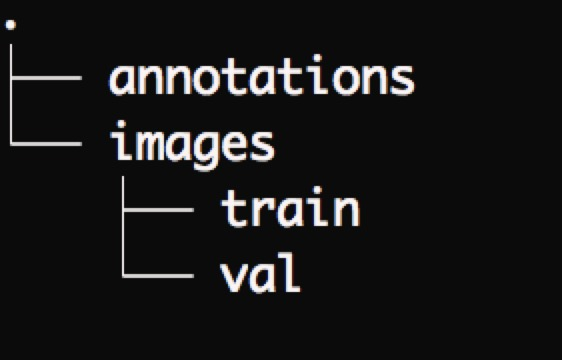
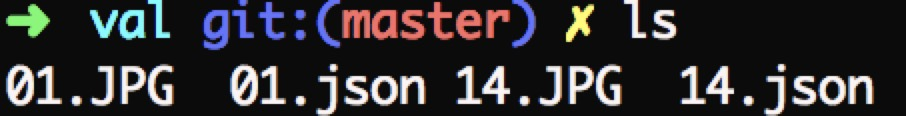

## This is an introduction of training self dataset.

I labeled my data of cars with [labelme](https://github.com/wkentaro/labelme)
and then I got my 32 images and 32 jsons under the same directory like this.

among which annotations is used for storing instances_train2017.json and instances_val2017.json generated in next step and images/train, images/val for storing original images and jsons generated by labelme.

then use [labelme2coco.py](https://github.com/CeciliaPYY/pytorch-deeplab-xception/blob/master/labelme2coco.py) to generate instances_train2017.json and instances_val2017.json

'''
python labelme2coco.py --type train --directory ./data_annotated_20180130/images/train --output ./data_annotated_20180130/annotations 
'''

'''
python labelme2coco.py --type val --directory ./data_annotated_20180130/images/val --output ./data_annotated_20180130/annotations 
'''

### 1. first edit [mypath.py](https://github.com/CeciliaPYY/pytorch-deeplab-xception/blob/master/mypath.py) like below

### 2. make your datasets like the following structure

and then you can follow the instructions of jfzhang95 to start your training!

### 3. besides, test.py (easy version to test speed and performance) has been added in this repo

