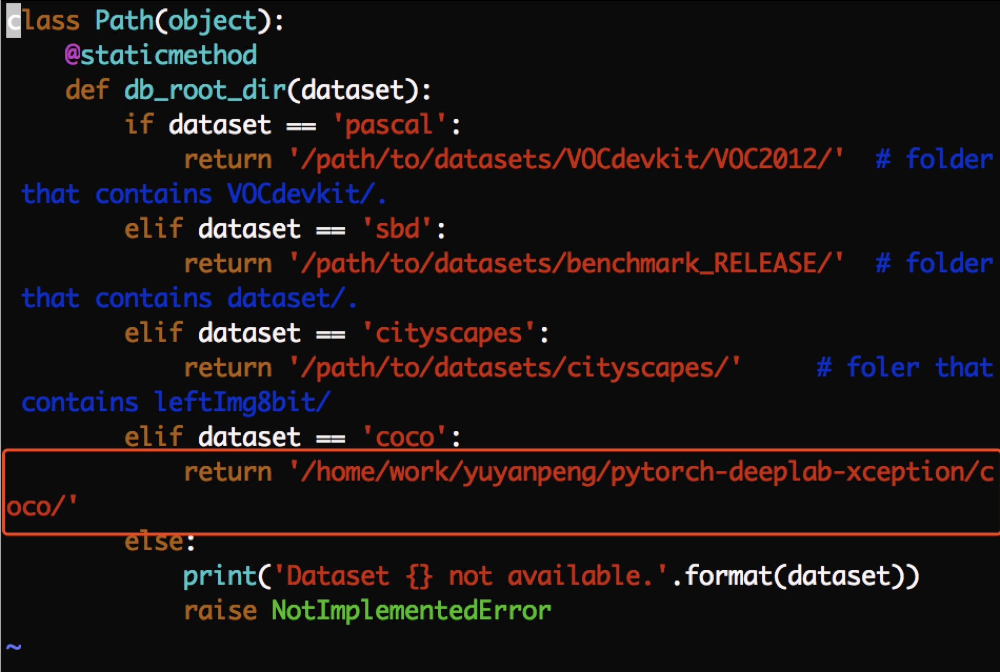
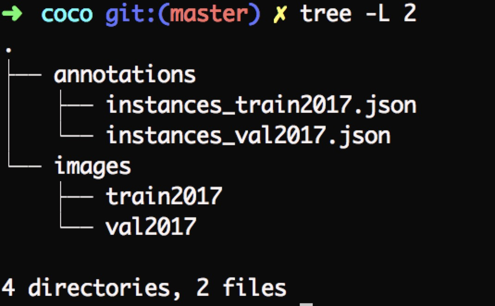

## This is an introduction of training self dataset.
1. first edit [mypath.py](https://github.com/CeciliaPYY/pytorch-deeplab-xception/blob/master/mypath.py) like below

2. make your datasets like the following structure

and then you can follow the instructions of jfzhang95 to start your training!

3. besides, test.py (easy version to test speed and performance) has been added in this repo

